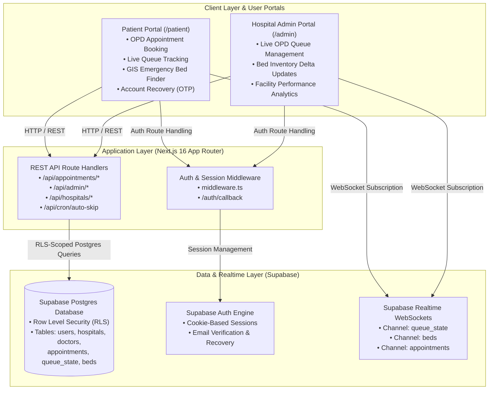

# CareSync

CareSync is a full-stack, real-time web application for outpatient department (OPD) queue management and emergency hospital bed tracking. Built for healthcare facilities and patients, the platform replaces physical token systems with dynamic digital queues and provides live GIS-mapped visibility into hospital bed availability.

---

## Architecture & System Overview

CareSync operates as a dual-portal application with separate views for patients and hospital administration staff.




### Core Portals

* **Patient Portal (`/patient`)**: Allows users to register, book OPD appointments with specific specialists, track live queue progress in real-time, locate emergency beds via Leaflet/OpenStreetMap, and request passwordless account recovery.
* **Hospital Staff Portal (`/admin`)**: Provides hospital administrators and clinical staff with scoped access to manage active queues (starting consultations, completing visits, skipping no-shows), update bed inventory deltas, and inspect facility performance analytics.

---

## Features

### OPD Queue Engine
* **Sequential Digital Tokens**: Generates non-duplicating token numbers per doctor per consultation date.
* **Real-time Queue Subscriptions**: Pushes instant token updates (`now_serving_token`) to patient devices using WebSockets via Supabase Realtime.
* **Automated Queue Skipping**: Provides an automated background cron endpoint (`/api/cron/auto-skip`) to advance stagnant tokens.

### Emergency Bed Tracker
* **Geospatial Hospital Mapping**: Interactive Leaflet.js map tracking hospital locations with dynamic ward-level bed metrics.
* **Ward-Level Filtering**: Filters bed availability across ICU, General, and Emergency wards.
* **Atomic Inventory Updates**: Enforces incremental bed count adjustments (`+1` / `-1`) to prevent race conditions during concurrent bed allocations.

### Security & Authentication
* **Role-Based Access Control**: Enforces strict Row Level Security (RLS) policies across `patient`, `hospital_admin`, and `super_admin` roles.
* **Passwordless OTP & Account Recovery**: Supports email-based verification codes and password recovery workflows.

---

## Tech Stack

| Layer | Technologies |
| --- | --- |
| **Framework** | Next.js 16.3.0 (App Router, Turbopack) |
| **Language** | TypeScript 5 |
| **Frontend & Styling** | React 19, Tailwind CSS v4, Lucide React |
| **3D & Graphics** | Three.js |
| **Mapping** | Leaflet.js 1.9.4, OpenStreetMap |
| **Database** | Supabase Postgres |
| **Authentication** | Supabase Auth (`@supabase/ssr`) |
| **Realtime Engine** | Supabase Realtime (WebSocket channels) |
| **PWA & Offline** | Service Worker (`sw.js`), Web App Manifest |

---

## Project Structure

```text
caresync/
├── app/                        # Next.js App Router routes & API endpoints
│   ├── (auth)/                 # Authentication routes (login, signup, reset-password)
│   ├── admin/                  # Hospital admin dashboard & super-admin portals
│   ├── api/                    # REST API route handlers
│   │   ├── admin/              # Queue management, bed updates, analytics, invites
│   │   ├── appointments/       # Booking, token retrieval, status checks
│   │   ├── auth/               # User registration endpoints
│   │   ├── cron/               # Automated background queue tasks
│   │   ├── doctors/            # Doctor query endpoints
│   │   ├── health/             # Healthcheck endpoint
│   │   └── hospitals/          # Hospital listings & emergency bed availability
│   ├── auth/callback/          # Supabase OAuth & PKCE auth callback handler
│   ├── patient/                # Patient dashboard, appointment booking, queue viewer
│   ├── globals.css             # Tailwind CSS & global styles
│   ├── layout.tsx              # Root application layout
│   ├── page.tsx                # Landing page
│   ├── robots.ts               # Robots.txt generator
│   └── sitemap.ts              # Sitemap generator
├── components/                 # React UI components
│   ├── DynamicEmergencyMap.tsx # Dynamic import wrapper for Leaflet map
│   ├── EmergencyMap.tsx        # Leaflet map implementation
│   ├── LiquidEther.tsx         # Ambient WebGL background effect
│   └── PWARegister.tsx         # Service worker registration component
├── lib/                        # Shared utility libraries
│   ├── auth.ts                 # Auth helper functions (signup, login, OTP recovery)
│   ├── bedFinderRanking.ts     # Ranking logic for emergency bed search
│   └── supabase/               # Supabase client & server client initializers
├── public/                     # Static assets & PWA files
│   ├── manifest.json           # PWA web app manifest
│   └── sw.js                   # Service worker script
├── scripts/                    # Database setup & verification scripts
├── supabase/                   # Database schemas, RLS policies, & seeds
│   ├── fixup_seed.sql          # Seed script for initial setup
│   ├── schema.sql              # Core table definitions, functions, & RLS policies
│   └── migrations/             # Database migration files
├── middleware.ts               # Next.js auth session middleware
├── next.config.ts              # Next.config definition
├── vercel.json                 # Vercel deployment & cron schedule configuration
└── package.json                # Project dependencies and npm scripts
```

---

## Environment Variables

Create a `.env.local` file in the project root with the following keys:

```env
NEXT_PUBLIC_SUPABASE_URL=https://your-project.supabase.co
NEXT_PUBLIC_SUPABASE_ANON_KEY=your-supabase-anon-key
SUPABASE_SERVICE_ROLE_KEY=your-supabase-service-role-key
SUPABASE_DB_PASSWORD=your-database-password
```

---

## Local Setup & Development

### 1. Prerequisites
* **Node.js**: 18.x or higher
* **npm**: 9.x or higher
* **Supabase Project**: Active project with database access

### 2. Installation
Clone the repository and install dependencies:

```bash
git clone https://github.com/Pranajit01/caresync.git
cd caresync
npm install
```

### 3. Database Initialization
Run the schema script against your Supabase database via the Supabase SQL Editor:

1. Execute the contents of [`supabase/schema.sql`](supabase/schema.sql) to create tables, RLS policies, triggers, and RPC functions.
2. Run [`supabase/fixup_seed.sql`](supabase/fixup_seed.sql) to populate initial hospital, doctor, and bed inventory seed data.

### 4. Start Development Server
Run the local development server with Turbopack:

```bash
npm run dev
```

Open [http://localhost:3000](http://localhost:3000) in your browser.

---

## Scripts & CLI Commands

| Command | Action |
| --- | --- |
| `npm run dev` | Starts the Next.js development server with Turbopack |
| `npm run build` | Compiles the production build |
| `npm run start` | Runs the compiled production build locally |
| `npm run lint` | Runs ESLint analysis |

---

## Database Architecture & RLS

CareSync uses 6 core Postgres tables configured with Row Level Security:

| Table | Description | RLS Policy Summary |
| --- | --- | --- |
| `users` | User profile data linked to `auth.users` | Patients read/update own record. Super admins have full access. |
| `hospitals` | Facility metadata (name, address, coordinates) | Public read access. Super admin write access. |
| `doctors` | Staff directory linked to hospitals | Public read access. Super admin write access. |
| `appointments` | Booked patient tokens per doctor & date | Patients access own records. Hospital admins access records for their assigned facility. |
| `queue_state` | Current consultation status (`now_serving_token`) | Public read access. Scoped write access for hospital admins. |
| `beds` | Inventory counts by ward type (`ICU`, `General`, `Emergency`) | Public read access. Hospital admins update bed counts for their facility. |

---

## API Endpoints

### Authentication & Users
* `POST /api/auth/signup` – Register a user profile with role metadata.

### Public & Patient Endpoints
* `GET /api/hospitals` – Query list of hospitals.
* `GET /api/doctors` – Query doctors by hospital or specialization.
* `GET /api/hospitals/emergency-beds` – Retrieve live bed availability across hospitals.
* `POST /api/appointments/book` – Book an appointment and generate a sequential token.
* `GET /api/appointments/my-tokens` – Retrieve appointments for the authenticated patient.
* `GET /api/appointments/[id]` – Retrieve details for a specific appointment.

### Hospital Administration Endpoints
* `GET /api/admin/my-hospital` – Fetch hospital details for the logged-in staff member.
* `GET /api/admin/queue/today` – Retrieve today's OPD queue status for facility doctors.
* `POST /api/admin/queue/start-consultation` – Advance doctor queue to next patient token (`in_progress`).
* `POST /api/admin/queue/mark-complete` – Mark current consultation `completed`.
* `POST /api/admin/queue/skip` – Skip no-show token.
* `POST /api/admin/queue/confirm-present` – Confirm patient arrival.
* `GET /api/admin/beds` – Retrieve facility bed inventory.
* `POST /api/admin/beds/update` – Increment/decrement bed counts.
* `POST /api/admin/beds/reconcile` – Reconcile bed inventory counts.
* `GET /api/admin/analytics` – Retrieve hospital queue and bed metrics.
* `POST /api/admin/invites` – Manage staff invitations.
* `POST /api/admin/verify-hospital` – Verify hospital administrator status.

### Background Tasks & Utilities
* `GET /api/cron/auto-skip` – Scheduled cron job to skip stale queue tokens.
* `GET /api/health` – Returns operational health status of the application.

---

## Deployment

The application is optimized for deployment on Vercel.

1. Connect the GitHub repository to Vercel.
2. Configure the required environment variables (`NEXT_PUBLIC_SUPABASE_URL`, `NEXT_PUBLIC_SUPABASE_ANON_KEY`, `SUPABASE_SERVICE_ROLE_KEY`).
3. Ensure the project build command is set to `next build`.

Cron tasks configured in [`vercel.json`](vercel.json) automatically trigger `/api/cron/auto-skip` on a daily schedule.

---

## License

This project is open-source and available under the terms defined in the repository.
