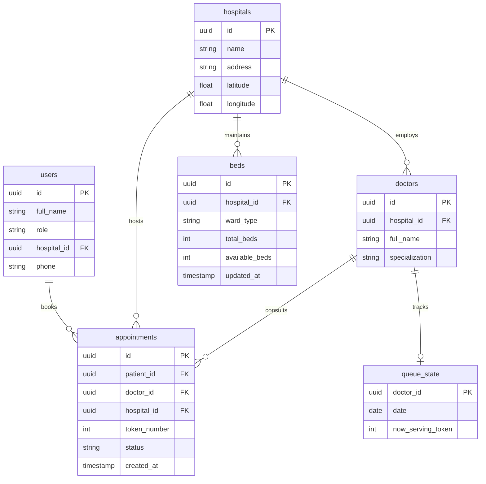

# CareSync — Connected Care. Better Health.

A Real-Time Platform for Smart OPD Queue Management & Emergency Healthcare Coordination in Kolkata.

---

## 📌 Problem Statement
OPD outpatient departments suffer from severe overcrowding and unpredictable wait times because physical token systems fail to reflect real doctor consultation pace. In medical emergencies, critical time is lost because patients and families do not have visibility into live bed availability across nearby hospitals.

**CareSync** solves both problems with a unified, dual-portal real-time web application:
1. **Live OPD Queue Engine**: Digital token allocation with real-time queue position tracking, auto-advancing token status, and dynamic wait time estimation via Supabase Realtime subscriptions.
2. **Emergency Bed Finder**: Interactive OpenStreetMap & Leaflet.js map tracking live bed availability across Kolkata hospitals per ward type (ICU, General, Emergency) with atomic server-side delta updates.

---

## 🚀 Key Features

### 👤 Patient Portal (`/patient`)
- **Supabase Authentication**: Email & password authentication storing user role metadata.
- **OPD Appointment Booking**: Step-by-step wizard (Select Kolkata Hospital → Select Specialist → Select Date & Time Slot → Confirm).
- **Sequential Digital Tokens**: Atomic Postgres sequence generation ensuring zero duplicate token numbers per doctor/date.
- **Live Queue Tracker**: Real-time position viewer showing *"Now Serving"* token vs *"Your Token"*, queue progress bar, live connection indicator, and dynamic estimated wait time.
- **Emergency Bed Finder**: Interactive map & list view showing live available beds across major Kolkata hospitals with ward filters (ICU, General, Emergency) and Google Maps directions links.

### 🏥 Hospital Staff Admin Portal (`/admin`)
- **Hospital-Scoped Dashboard**: Strict Row Level Security (RLS) ensuring staff only view and manage data for their assigned hospital.
- **OPD Queue Manager**: Live view of today's patient tokens with advance controls (**▶ Start Consultation** & **✅ Mark Complete**).
- **Emergency Bed Manager**: Atomic **+1** (discharge) / **-1** (admit) bed availability controls per ward (`ICU`, `General`, `Emergency`) per Section 7 specs.
- **Real-Time Analytics**: Read-only dashboard reporting *Patients Served Today*, *Average Wait Time*, *Total OPD Bookings*, and *Department Bed Occupancy Rate*.

---

## 🛠️ Tech Stack

| Layer | Technology | Purpose |
|---|---|---|
| **Frontend** | Next.js 16 (App Router) + TypeScript | Server & client component rendering, dynamic routing |
| **Styling** | Tailwind CSS v4 + Inter Font | Modern, medical-trust aesthetic with clean spacing & hierarchy |
| **Backend & APIs** | Next.js Route Handlers | Unified full-stack API layer |
| **Database & Auth** | Supabase Postgres + Supabase Auth | Relational data, RLS security policies, auth sessions |
| **Realtime Engine** | Supabase Realtime | WebSockets change subscriptions for live queue & bed updates |
| **Maps & Routing** | Leaflet.js + OpenStreetMap | Free, zero-API-key interactive GIS mapping |
| **Icons** | Lucide React | Clean, consistent icons with zero raw emojis |

---

## 🏗️ Database Architecture & RLS

CareSync uses 6 core Postgres tables in Supabase with full Row Level Security:



### Row Level Security Policies
- **`patient`**: Can read public hospitals/doctors/beds; can only read/write their own rows in `appointments`.
- **`hospital_admin`**: Can read/write `appointments`, `queue_state`, and `beds` strictly where `hospital_id = get_my_hospital_id()`.

---

## ⚡ Atomic Concurrency & Safety Controls

1. **Sequential OPD Token Generation**: Uses `pg_advisory_xact_lock` inside the `book_appointment()` Postgres RPC function to guarantee sequential token allocation without race conditions.
2. **Atomic Bed Count Updates**: Per Section 7 rules, bed inventory updates strictly send `+1` / `-1` deltas via `update_bed_count()` RPC (`UPDATE beds SET available_beds = available_beds - 1 WHERE available_beds > 0`). Client applications never send absolute bed numbers.

---

## 💻 Local Setup & Execution

### 1. Prerequisites
- Node.js 18+ & npm
- A Supabase project (URL & Anon Key)

### 2. Environment Configuration
Create a `.env.local` file in the root directory:

```bash
NEXT_PUBLIC_SUPABASE_URL=https://your-supabase-project.supabase.co
NEXT_PUBLIC_SUPABASE_ANON_KEY=your-anon-key
SUPABASE_SERVICE_ROLE_KEY=your-service-role-key
```

### 3. Install Dependencies
```bash
npm install
```

### 4. Database Setup & Seed Data
Execute `supabase/fixup_seed.sql` inside your Supabase SQL Editor. This initializes all 6 tables, RLS policies, atomic RPC functions, and seed data for 5 major Kolkata hospitals:
- Apollo Multispecialty Hospitals
- AMRI Hospitals Mukundapur
- Fortis Hospital Anandapur
- CMRI (Calcutta Medical Research Institute)
- Belle Vue Clinic

### 5. Run Development Server
```bash
npm run dev
```
Open [http://localhost:3000](http://localhost:3000) in your browser.

---

## 🧪 Verification & Production Build

To verify code cleanliness and build for production:

```bash
# Type check
npx tsc --noEmit

# Production build
npm run build
```

---

## 📄 License
CareSync Platform &mdash; Real-Time Smart OPD & Emergency Healthcare.
